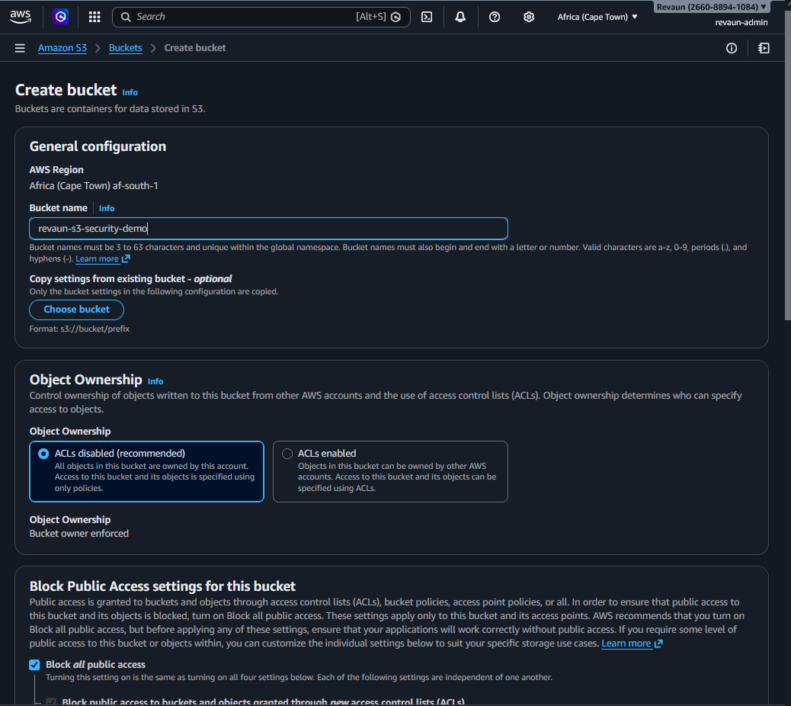
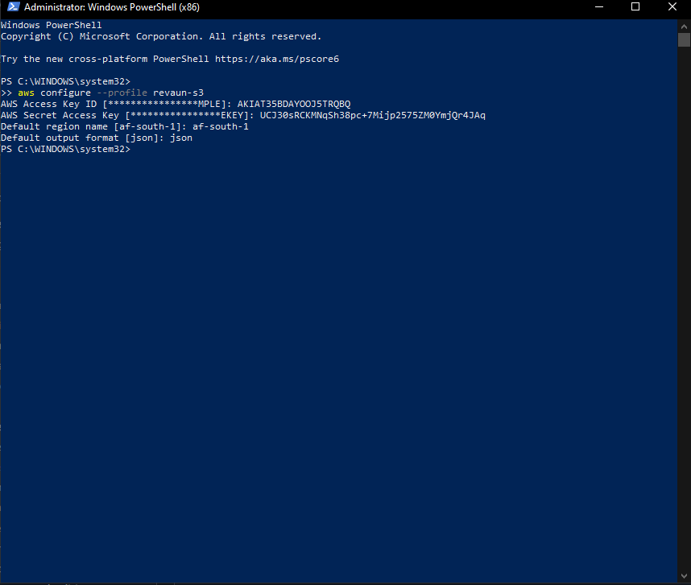
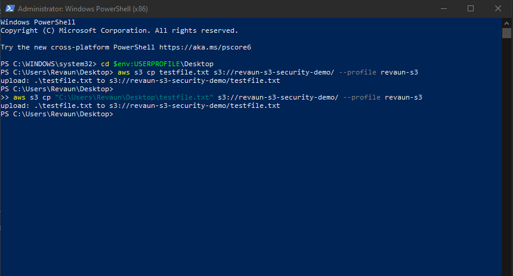
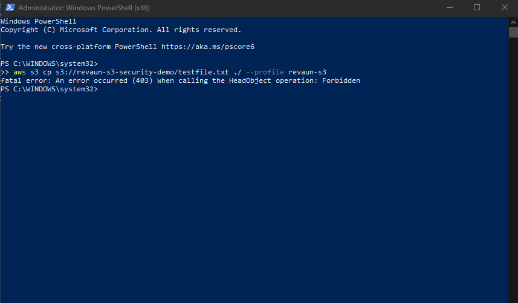

# AWS S3 Security Demo

A hands‑on demonstration of **IAM policy enforcement** in AWS S3.  
This project showcases the **principle of least privilege** by restricting a user to upload‑only access while denying downloads.

---

## 📂 Project Structure

---

## 🚀 Steps & Proof

### Step 1: Bucket Creation
  
*Screenshot: S3 bucket created for security demo*

---

### Step 2: IAM Policy Applied
  
*Screenshot: IAM policy attached to revaun-s3 user, restricting downloads*

---

### Step 3: CLI Configuration
  
*Screenshot: AWS CLI configured with revaun-s3 credentials*

---

### Step 4: Upload Test (Allowed)
  
*Screenshot: Upload to S3 bucket succeeded with revaun-s3*

---

### Step 5: Download Test (Denied)
  
*Screenshot: Download from S3 bucket denied by IAM policy*

---

## ✅ Outcome
This demo demonstrates the principle of least privilege:
- Uploads are permitted for the restricted IAM user.  
- Downloads are denied, enforcing controlled access.  

---

## 🔖 Repo Description
**Hands‑on AWS S3 Security Demo — IAM policy enforcing upload‑only access.**  
Tags: `AWS`, `IAM`, `S3`, `Cloud Security`, `DevOps`
