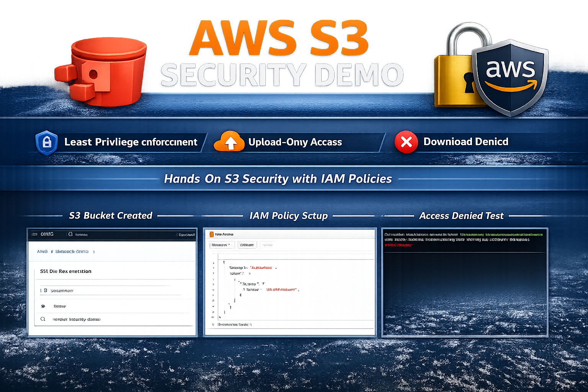
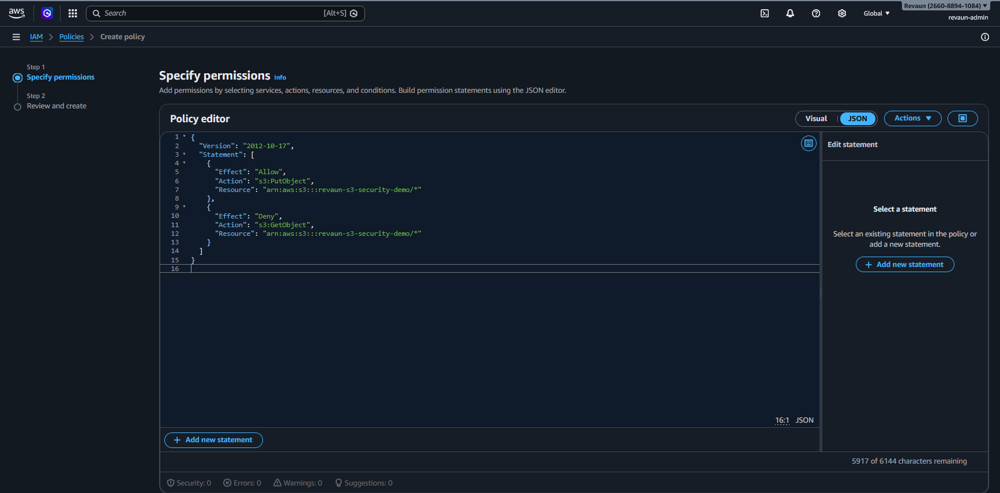

# AWS S3 Security Demo

A hands‑on demonstration of **IAM policy enforcement** in AWS S3.  
This project showcases the **principle of least privilege** by restricting a user to upload‑only access while denying downloads.

---

## 📂 Project Structure
- `snapshots/` → Proof screenshots  
- `README.md` → Documentation with embedded images  
- `policy.json` → IAM policy file  

---

## 🚀 Steps & Proof

### Step 1: Bucket Creation  
  
*Screenshot: S3 bucket created for security demo*

---

### Step 2: IAM Policy Applied  
  
*Screenshot: IAM policy attached to revaun-s3 user, restricting downloads*

---

### Step 3: CLI Configuration  

In this step, the AWS CLI was configured with the `revaun-s3` IAM user profile to enable secure interaction with the S3 bucket.

> ⚠️ **Security Hygiene Note:** Sensitive credentials have been redacted in the snapshot below to prevent exposure. This demonstrates awareness of cloud security best practices.

  
*Screenshot: AWS CLI configured with revaun-s3 credentials*

#### Commands Used
- `aws configure --profile revaun-s3`  
- `aws s3 ls --profile revaun-s3`

---

### Step 4: Upload Test (Allowed)  
  
*Screenshot: Upload to S3 bucket succeeded with revaun-s3*

---

### Step 5: Download Test (Denied)  
  
*Screenshot: Download from S3 bucket denied by IAM policy*

---

### Step 6: Security Hygiene Notes
- All sensitive credentials have been redacted from snapshots to prevent exposure.  
- IAM policies were applied following the principle of least privilege.  
- Demonstrates awareness of secure cloud practices and professional documentation standards.  

---

## 🔐 Commands Used
- `aws s3 mb s3://revaun-security-demo`  
- `aws iam create-user --user-name revaun-s3`  
- `aws iam put-user-policy --user-name revaun-s3 --policy-document file://policy.json`  
- `aws configure --profile revaun-s3`  
- `aws s3 cp test.txt s3://revaun-security-demo/ --profile revaun-s3`  
- `aws s3 cp s3://revaun-security-demo/test.txt ./ --profile revaun-s3`  

*(Commands are inline — no grey copy box)*

---

## ✅ Outcome
This demo demonstrates the principle of least privilege:
- Uploads are permitted for the restricted IAM user.  
- Downloads are denied, enforcing controlled access.  

---

## 🔖 Repo Description
**Hands‑on AWS S3 Security Demo — IAM policy enforcing upload‑only access.**  
Tags: `AWS`, `IAM`, `S3`, `Cloud Security`, `DevOps`
